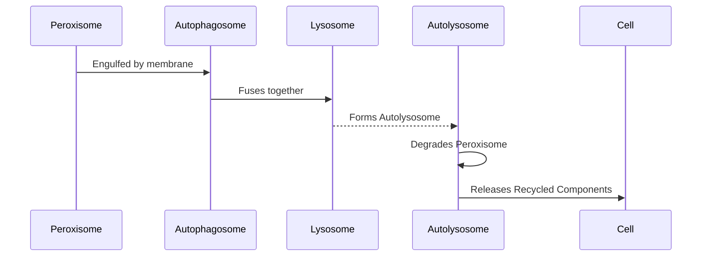

# Cell, an absurd simulation of a human cell.

This project aims at simulating a human cell, down to the molecular level.

# Inside of a cell

We consider here an [eucaryote](https://en.wikipedia.org/wiki/Eukaryote) stem cell. In simpler terms, a basic human cell
that has no function yet.

A cell can be seen as a huge and complex factory. It embeds a lots of smaller factories, each having a role to play.
These are the organelles.

Here are the organelles that are simulated so far:

## Peroxisome

### Overview

Peroxisomes are small, single-membrane-bound organelles found in virtually all eukaryotic cells. They play a crucial
role in cellular metabolism, particularly in lipid metabolism and the detoxification of reactive oxygen species.

### Key Functions

1. Beta-Oxidation of Fatty Acids
    * Process: Breakdown of very long-chain fatty acids (VLCFAs) into medium-chain fatty acids.
    * Importance: Provides substrates for energy production in mitochondria and prevents the accumulation of harmful
      fatty acids.
2. Detoxification of Hydrogen Peroxide
    * Process: Decomposition of hydrogen peroxide (H₂O₂) into water and oxygen.
    * Enzyme Involved: Catalase.
    * Importance: Protects the cell from oxidative damage caused by reactive oxygen species.

### Reactions Involved

#### Detoxification of Hydrogen Peroxide

Chemical Reaction:

```math
2\, \mathrm{H_2O_2} \xrightarrow{\text{Catalase}} 2\, \mathrm{H_2O} + \mathrm{O_2}
```

Explanation:

* Hydrogen Peroxide (H₂O₂): A toxic byproduct of various metabolic reactions.
* Catalase: An enzyme that accelerates the decomposition of hydrogen peroxide.
* Products: Water (H₂O) and oxygen (O₂), which are harmless to the cell.

Mermaid Diagram:

```mermaid
graph LR
H2O2[Hydrogen Peroxide<br>(2 H₂O₂)] --Catalase--> H2O[Water<br>(2 H₂O)] & O2[Oxygen<br>(O₂)]
```

#### Beta-Oxidation of Fatty Acids (Simplified)

General Reaction:

```math
 \mathrm{Fatty\ Acyl\text{-}CoA} + \mathrm{FAD} \rightarrow \mathrm{Enoyl\text{-}CoA} + \mathrm{FADH_2}
```

Explanation:

* Fatty Acyl-CoA: Activated form of a fatty acid.
* Enoyl-CoA: Product after the removal of two hydrogen atoms.
* FAD/FADH₂: Flavin adenine dinucleotide, an electron carrier involved in redox reactions.


## Lysosome

### Overview

Lysosomes are membrane-bound organelles containing a variety of hydrolytic enzymes. They are the digestive system of the cell, responsible for breaking down macromolecules, old cell parts, and microorganisms.

### Key Functions

1. Digestion of Macromolecules
* Process: Degradation of proteins, nucleic acids, lipids, and carbohydrates into their monomeric units.
* Enzymes Involved: Proteases, nucleases, lipases, glycosidases.
* Importance: Recycling of cellular components and energy production.
2. Autophagy
* Process: Removal of damaged organelles and cellular debris.
* Importance: Maintains cellular health and prevents accumulation of defective components.

### Reactions Involved

#### Protein Degradation

Chemical Reaction:

```math
\text{Protein} \xrightarrow{\text{Protease}} \text{Amino Acids}
```

Explanation:

* Proteins: Large biomolecules consisting of amino acid chains.
* Proteases: Enzymes that cleave peptide bonds.
* Amino Acids: Building blocks of proteins, which can be reused by the cell.


#### Nucleic Acid Degradation

Chemical Reaction:

```math
\text{Nucleic Acids} \xrightarrow{\text{Nuclease}} \text{Nucleotides}
```

Explanation:

* Nucleic Acids: DNA and RNA molecules carrying genetic information.
* Nucleases: Enzymes that hydrolyze phosphodiester bonds.
* Nucleotides: Monomers of nucleic acids, which can be recycled.


#### Lipid Degradation

Chemical Reaction:

```math
\text{Lipids} \xrightarrow{\text{Lipase}} \text{Fatty Acids} + \text{Glycerol}
```

Explanation:

* Lipids: Fats and oils used for long-term energy storage.
* Lipases: Enzymes that break down lipids.
* Products: Fatty acids and glycerol, which can enter metabolic pathways.


## Interaction Between Peroxisome and Lysosome

### Pexophagy (Selective Degradation of Peroxisomes)

#### Process Overview:

Pexophagy is a specific type of autophagy where damaged or superfluous peroxisomes are selectively degraded by lysosomes to maintain cellular homeostasis.

Steps Involved:

1. Recognition of Damaged Peroxisome
* Trigger: Damage or oxidative stress signals.
* Markers: Ubiquitination or receptor proteins on the peroxisome surface.
2. Formation of Autophagosome
* Encapsulation: The peroxisome is enveloped by a double-membrane structure called an autophagosome.
3. Fusion with Lysosome
* Autolysosome Formation: The autophagosome fuses with a lysosome, combining their contents.
4. Degradation
* Enzymatic Breakdown: Lysosomal enzymes degrade the peroxisome into basic biomolecules.
* Recycling: The resulting molecules are recycled for cellular use.

Mermaid Diagram:



Explanation:

* The peroxisome is targeted for degradation due to damage or cellular signals.
* An autophagosome forms around the peroxisome.
* Fusion with a lysosome creates an autolysosome.
* Lysosomal enzymes degrade the peroxisome.
* Breakdown products are released back into the cytoplasm for reuse.

